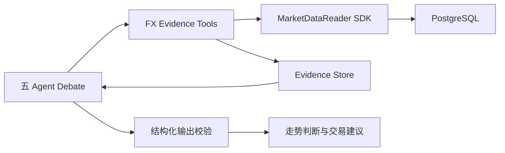
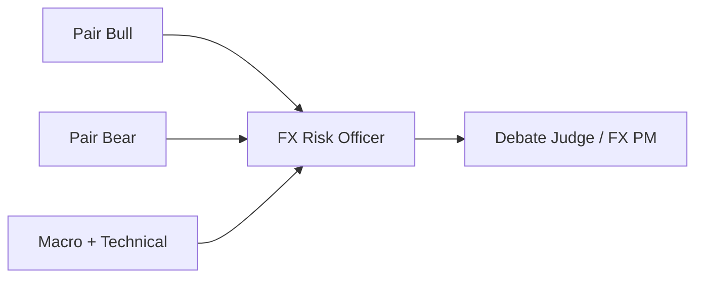

# EURUSD 五 Agent Debate MVP 实现汇报

## 一、项目目标

本项目使用五 Agent Debate 模型分析 EURUSD，综合多方、空方、宏观技术和风险视角，
给出未来走势判断及交易建议。

郭骁然负责的主要内容是：

- 五 Agent 的角色设计与执行逻辑；
- Agent 可调用 Tool 的设计与实现；
- Tool 与韦庆檑市场数据 SDK 的对接；
- Agent 输出、证据引用和风险约束校验；
- 用于真实五 Agent 测试的本地调试控制台。

当前 MVP 只开放 `EURUSD`，所有市场、宏观和新闻数据只允许来自内部 PostgreSQL，
不使用外部行情回退，也不会执行真实交易或下单。

## 二、总体实现思路

系统分为四层：



各层职责如下：

| 层级 | 主要职责 |
| --- | --- |
| Agent 层 | 从多空、宏观技术、风险和组合管理角度分析 EURUSD |
| Tool 层 | 决定查询哪些数据，并将 SDK 原始结果加工为可引用证据 |
| SDK 层 | 校验查询参数、解析金融工具并安全读取 PostgreSQL |
| 校验层 | 检查证据、输出结构、风险限制和最终决策的一致性 |

核心原则是：LLM 负责分析和辩论，Tool 负责提供证据，SDK 负责正确查询数据，
Python 校验逻辑负责守住最终结果边界。

## 三、五 Agent 的实现

### 3.1 Agent 分工



| Agent | 职责 |
| --- | --- |
| Pair Bull | 只构建 EURUSD 上涨案例 |
| Pair Bear | 只构建 EURUSD 下跌案例 |
| Macro + Technical | 中立分析欧美相对宏观强弱、趋势、动量和波动 |
| FX Risk Officer | 审核前三个 Agent 的证据、观点冲突和交易风险 |
| Debate Judge / FX PM | 综合全部观点和风控要求，给出唯一最终决策 |

Bull、Bear 和 Macro + Technical 并行运行。Risk 必须等待前三个 Agent 完成，
Judge 必须等待 Risk 完成。

### 3.2 Agent 配置

五个 Agent 统一定义在 `fx_debate_team.yaml` 中。每个 Agent 配置：

- 唯一 `id` 和角色；
- System Prompt；
- 可调用 Tool 白名单；
- 最大推理轮数；
- 超时时间；
- 最大重试次数；
- 上下游任务依赖关系。

例如 Pair Bull 可以使用行情、宏观、新闻和输出校验 Tool，但不能调用项目中其他
未授权 Tool，也不能绕过 Tool 直接访问数据库。

### 3.3 Agent 内部执行

每个 Agent 由 Swarm Worker 执行简化的 ReAct 循环：

```text
构造 System Prompt 和 User Prompt
→ 调用 LLM
→ LLM 返回分析文字或 Tool Call
→ Worker 执行 Tool
→ 将 Tool Result 加回 Agent 上下文
→ 再次调用 LLM
→ 生成结构化最终输出
```

Agent 输入包括：

- Agent 角色和分析要求；
- 当前 EURUSD 请求；
- 本次运行的 Evidence Context；
- 允许使用的 Tool；
- 上游 Agent 的完整输出。

第一层三个 Agent 相互隔离，避免 Bull 和 Bear 相互影响。Risk 和 Judge 通过
`Upstream Context` 接收上游输出。

## 四、Tool 的实现

### 4.1 Tool 的统一结构

所有 Tool 都基于统一 `BaseTool` 接口实现：

```python
class SomeTool(BaseTool):
    name = "tool_name"
    description = "Tool 的能力说明"
    parameters = {...}

    def execute(self, **kwargs):
        # 参数校验
        # 业务处理
        # 返回 JSON
```

Worker 根据 Agent 的 Tool 白名单创建 `ToolRegistry`。LLM 发出 Tool Call 后，
Worker 根据 Tool 名称找到对应实现，执行并将结果返回给 Agent。

### 4.2 主要 Tool

| Tool | 内部逻辑 |
| --- | --- |
| `run_fx_debate` | 校验请求、创建 Evidence Context、启动五 Agent、执行最终校验并生成报告 |
| `get_fx_market_evidence` | 查询报价和 K 线，计算 4H/1D 技术指标并生成证据 |
| `get_fx_macro_evidence` | 查询 EURUSD 正式关联的宏观指标并生成证据 |
| `get_fx_news_evidence` | 查询 EURUSD 正式关联的内部新闻并生成证据 |
| `get_fx_evidence_by_ids` | 按 evidence ID 回查本次运行已经登记的完整证据 |
| `validate_fx_output` | 校验 AgentArgument、RiskReview 和 FinalDecision |

### 4.3 行情 Tool 的处理过程

`get_fx_market_evidence` 会调用：

```text
MarketDataReader.get_latest_prices
MarketDataReader.get_market_bars(daily)
MarketDataReader.get_market_bars(hourly)
```

Tool 得到原始数据后执行：

1. 过滤晚于本次 `as_of` 的数据；
2. 清洗无效 K 线；
3. 将小时线聚合为 4H；
4. 计算 EMA20、EMA50、RSI14、ATR14、波动率和区间高低点；
5. 为每项结果生成稳定的 `evidence_id`；
6. 保存至本次运行的 Evidence Store；
7. 返回 Agent 可以引用的结构化证据。

### 4.4 宏观和新闻 Tool

宏观 Tool 调用 `get_macro_observations`，保留实际值、前值、预测值、修正值、
发布时间、指标 ID 和数据来源。

新闻 Tool 调用 `get_news`，保留标题、摘要、发布时间、情绪分数、相关度和数据库
记录 ID。为控制 LLM 上下文长度，不会复制完整长正文。

SDK 只返回数据，不判断其对 EURUSD 的方向影响。相对宏观强弱和新闻影响由 Agent
结合其他证据分析。

## 五、SDK 的实现逻辑

SDK 采用两层结构：

```text
MarketDataReader
→ MarketDatabaseClient
→ PostgreSQL
```

### 5.1 MarketDataReader

当前 Tool 使用四个公开接口：

```python
get_latest_prices(...)
get_market_bars(...)
get_macro_observations(...)
get_news(...)
```

每次查询依次执行：

1. 校验并标准化 `symbol`、`source`、日期、频率和 `limit`；
2. 通过 `instrument_master` 将 `EURUSD` 解析为内部 `instrument_id`；
3. 使用 `instrument_id` 查询对应业务表；
4. 返回统一的结构化字典。

不同数据走不同的正式关联关系：

```text
最新报价：instrument_master → latest_prices
K 线：instrument_master → market_bars
宏观：instrument_master → instrument_metric_link → macro_observations
新闻：instrument_master → news_instrument_link → news_articles
```

宏观和新闻查询不依赖关键词猜测，而是使用数据库中已经建立的正式关系。

### 5.2 MarketDatabaseClient

数据库客户端负责：

- 建立 PostgreSQL 短连接；
- 启用只读事务；
- 设置连接和查询超时；
- 执行固定的参数化 SQL；
- 将数据库行转换成 Python 字典；
- 查询结束后关闭连接。

来自 Agent 的输入只会作为 SQL 参数绑定，不会拼接到 SQL 字符串中。

## 六、证据一致性设计

每次运行首先创建不可变 `EvidenceContext`，其中固定：

- `EURUSD`；
- 数据截止时间；
- 研究期限；
- 4H/1D 分析周期；
- 数据来源策略；
- 唯一 `evidence_context_id`。

每次查询根据 Context、查询类型和参数生成稳定的 `query_id`。如果 Bull 已经执行过
相同查询，Bear 和 Macro Agent 会读取冻结结果，不会重新查询数据库。

```text
相同 Evidence Context + 相同查询参数
→ 相同 query_id
→ 相同数据库结果
→ 相同 evidence_id
```

这样可以保证并行 Agent 使用同一份数据快照。

运行证据保存在：

```text
agent/.swarm/runs/<run_id>/fx_debate/
├── contexts/
├── queries/
└── evidence/
```

## 七、结构化输出与最终校验

前三个 Agent 输出 `AgentArgument`，Risk 输出 `RiskReview`，Judge 输出
`FinalDecision`。

### AgentArgument

主要包含：

- Agent 观点和分析状态；
- 核心 Claims；
- 每个 Claim 引用的 evidence IDs；
- 交易案例和失效条件；
- 置信度和缺失数据。

### RiskReview

主要包含：

- 通过和拒绝的 Claims；
- 重复或冲突证据；
- 允许的交易操作；
- 最大单笔风险比例；
- 强制失效条件。

### FinalDecision

主要包含：

- `long`、`short`、`wait` 或 `hedge`；
- 置信度和情景概率；
- 核心判断；
- 入场、止损和目标；
- 风险说明和复核条件；
- 关键 evidence IDs。

`validate_fx_output` 会检查：

- 输出是否符合结构；
- Evidence Context 是否一致；
- evidence ID 是否真实存在；
- Judge 是否遵守 Risk 的 `allowed_actions`；
- 风险比例是否超限；
- 数据不足时是否选择 `wait` 或 `hedge`；
- 交易参数和决策方向是否一致。

Agent 生成结果后会主动调用一次校验，`run_fx_debate` 在五 Agent 完成后还会执行一次
最终确定性校验。

## 八、真实运行调试控制台

为方便测试真实五 Agent，增加了独立本地调试控制台。

界面实时显示：

- 当前正在运行的 Agent；
- Agent 的输入和最终输出；
- Tool 的脱敏输入、输出、状态和耗时；
- MarketDataReader SDK 的调用输入和结果预览；
- PostgreSQL 参数化 SQL、绑定参数、字段、行数和结果预览；
- 当前正在工作的 Agent、Tool、SDK 和数据库查询；
- 最终方向判断、置信度和完整报告。

前端通过增量事件接口读取运行过程：

```text
GET /api/runs/{job_id}/events?after={sequence}
```

API key、数据库密码、Token、Authorization 和个人账户标识在进入浏览器前会再次
脱敏。

## 九、当前测试结果

当前已完成：

- 192 项 Swarm 回归测试；
- 59 项 FX Debate、Tool、SDK、数据库和可观测接口相关测试；
- FastAPI 启动和健康检查；
- 前端静态资源和事件轮询接口验证。

测试覆盖：

- 五 Agent DAG 和角色配置；
- Tool 注册与白名单；
- Evidence Context 和查询缓存；
- SDK 参数校验与 PostgreSQL 查询路径；
- Agent、Tool、SDK 和数据库事件；
- 输出结构、证据存在性和风险约束；
- 真实运行任务的启动、状态查询和单任务限制。

## 十、当前 MVP 边界

目前仍有以下限制：

1. 只开放 EURUSD，其他货币对需要完成数据库覆盖验收；
2. 数据只来自内部 PostgreSQL，没有外部数据回退；
3. 测试控制台一次只允许运行一个真实 Debate；
4. 前端任务状态保存在服务进程内，服务重启后需要重新启动任务；
5. Agent 结果仅作为研究辅助，不构成保证收益或自动下单指令；
6. 当前不连接任何交易执行系统。

## 十一、总结

本 MVP 已经打通：

```text
EURUSD 请求
→ 五 Agent Debate
→ FX Evidence Tool
→ 韦庆檑 MarketDataReader SDK
→ PostgreSQL
→ Evidence Store
→ 风控审核
→ Judge 最终决策
→ 中文走势判断与交易建议
```

实现重点不是让五个 Agent 自由讨论，而是通过 Tool 白名单、统一 SDK、Evidence
Context、稳定 evidence ID 和最终结构校验，使每个观点都能够回查到本次运行中的
真实内部数据。
